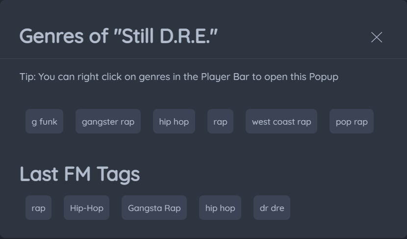

# Spotify Genres

See what genres you are listening to with this [Spicetify](https://spicetify.app/) extension.

## Previews

### See in player

You can see the genres of the currently playing song.


### See in a pop-up

Right click on a genre in the player bar.



## Install Manually

Copy [`spotifyGenres.js`](https://raw.githubusercontent.com/Vexcited/better-spotify-genres/build/spotifyGenres.js) from the `build` branch into your [Spicetify](https://github.com/spicetify/spicetify-cli) extensions directory:

| **Platform** | **Path**                                                                             |
| ------------ | ------------------------------------------------------------------------------------ |
| **Linux**    | `~/.config/spicetify/Extensions` or `$XDG_CONFIG_HOME/.config/spicetify/Extensions/` |
| **MacOS**    | `~/spicetify_data/Extensions` or `$SPICETIFY_CONFIG/Extensions`                      |
| **Windows**  | `%appdata%\spicetify\Extensions`                                                     |

After putting the extension file into the correct folder, run the following command to install the extension:

```bash
spicetify config extensions spotifyGenres.js
spicetify apply
```

## Install from Marketplace

You can install this extension from the Spicetify Marketplace, just search for "Better Spotify Genres" and click install.

## Development

## Credits

Forked from [Tetrax-10's Spotify-Genres](https://github.com/Tetrax-10/Spicetify-Extensions).
